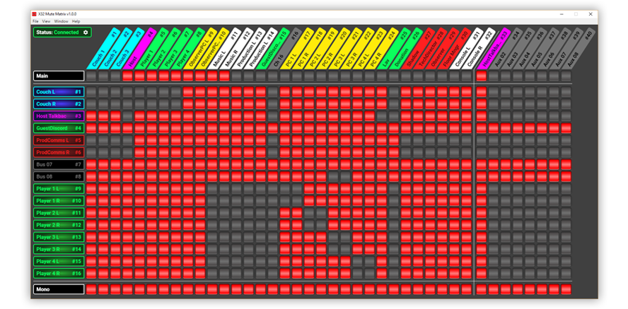

# X32 Mute Matrix

> See and configure the mute status of all your Behringer X32's channels (on every mixbus) in one place.

## Motivation
Sometimes, as the operator of an audio mixer, you just really want to see (and configure) the mute status of every channel on every bus. This program enables you to do this for your Behringer X32/M32 digital mixers.

## Features
- Manage and monitor the mute status of all 32 main inputs and 8 aux inputs on the Main bus, all 16 mixbuses, and the mono bus.
- Automatically pulls the names and colors of every bus/channel from the X32
- Connection history that remembers device addresses that have been connected to in the past.
- Installers available for Windows, macOS, and Linux.

## Planned Features
- Stereo bus on/off
- Redesigned row and column headers
- Automatic discovery of X32/M32 devices
- Connection status indicator
- Automatic reconnection to previous device on program start
- Collapsing/folding of linked channels & buses
- Choose which channels and buses to show or hide
- Set the names and colors of channels and buses
- iOS and Android support

## Installation
Check the [Releases](https://github.com/lange/x32-mute-matrix/releases) page to grab the latest installer for your operating system.
Once installed, the application will autoupdate.

## Credits
Developed by [Alex Van Camp](https://twitter.com/vancamp)  
Assets and additional design by [Chris Hanel](https://twitter.com/chrishanel)
QA and feedback provided by [Mark Schwartzkopf](https://twitter.com/m_schwartzkopf)

## License
X32 Mute Matrix is provided under the MIT license, which is available to read in the 
[LICENSE](https://github.com/lange/x32-mute-matrix/blob/master/LICENSE) file.
